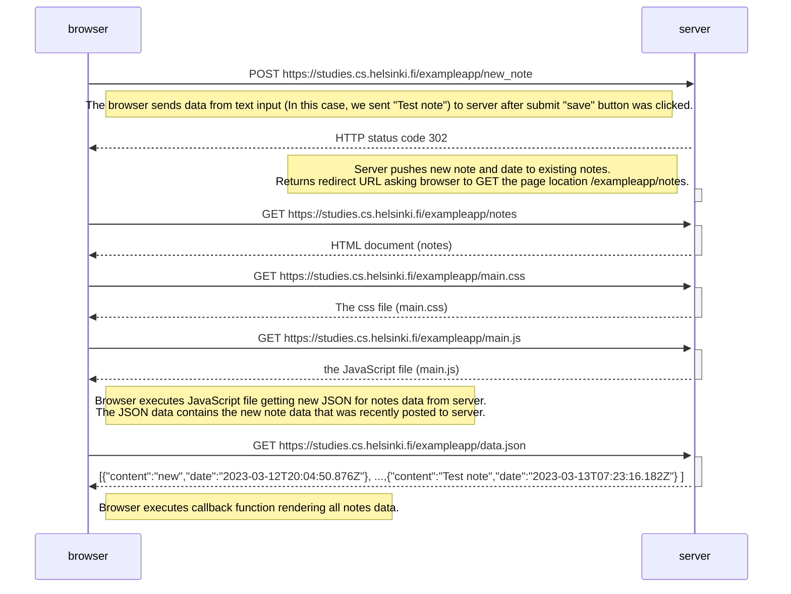

```mermaid
sequenceDiagram
participant browser
participant server

    browser->>server: POST https://studies.cs.helsinki.fi/exampleapp/new_note
    Note right of browser: The browser sends data from text input (In this case, we sent "Test note") to server after submit "save" button was clicked.
    activate server
    server-->>browser: HTTP status code 302
    Note left of server: Server pushes new note and date to existing notes. <br>Returns redirect URL asking browser to GET the page location /exampleapp/notes.
    activate server
    deactivate server

    browser->>server: GET https://studies.cs.helsinki.fi/exampleapp/notes
    activate server
    server-->>browser: HTML document (notes)
    deactivate server

    browser->>server: GET https://studies.cs.helsinki.fi/exampleapp/main.css
    activate server
    server-->>browser: The css file (main.css)
    deactivate server

    browser->>server: GET https://studies.cs.helsinki.fi/exampleapp/main.js
    activate server
    server-->>browser: the JavaScript file (main.js)
    deactivate server

    Note right of browser: Browser executes JavaScript file getting new JSON for notes data from server. <br>The JSON data contains the new note data that was recently posted to server.

    browser->>server: GET https://studies.cs.helsinki.fi/exampleapp/data.json
    activate server
    server-->>browser: [{"content":"new","date":"2023-03-12T20:04:50.876Z"}, ...,{"content":"Test note","date":"2023-03-13T07:23:16.182Z"} ]
    deactivate server

    Note right of browser: Browser executes callback function rendering all notes data.

```
