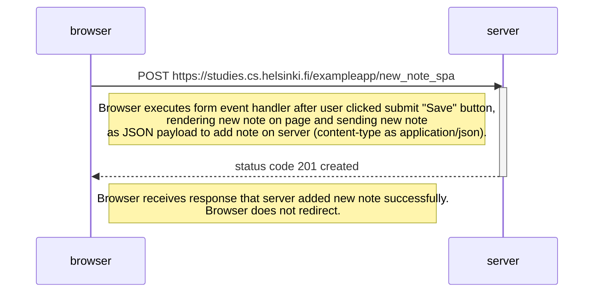

```mermaid
sequenceDiagram
participant browser
participant server


    browser->>server: POST https://studies.cs.helsinki.fi/exampleapp/new_note_spa
    activate server

    Note right of browser: Browser executes form event handler after user clicked submit "Save" button, <br> rendering new note on page and sending new note <br> as JSON payload to add note on server (content-type as application/json).


    server-->>browser: status code 201 created
    deactivate server

    Note right of browser: Browser receives response that server added new note successfully. <br>Browser does not redirect.

```
